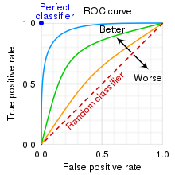
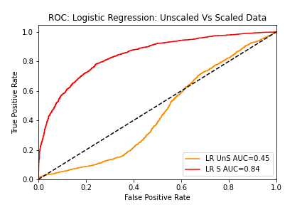
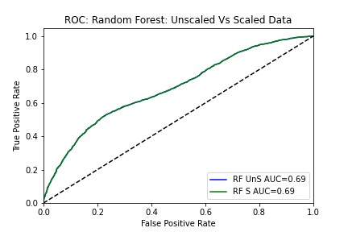
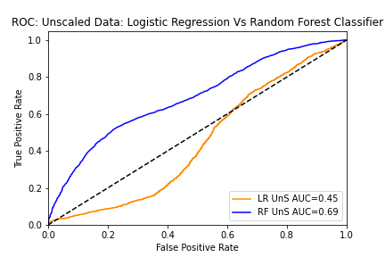
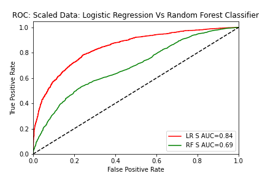
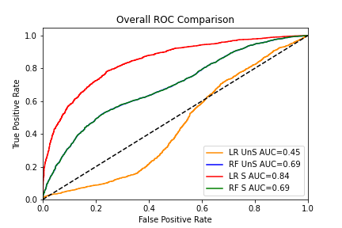
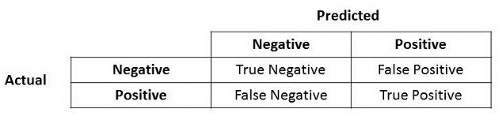
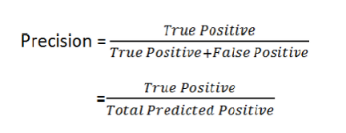
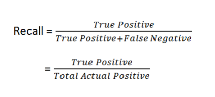
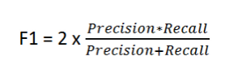

# Supervised-Machine-Learning-Challenge

Machine learning model is developed for the LendingClub lending services company. This model would predict whether a loan from the company will become high risk or not.

Based on the loan data from the year 2019, the model is trying to predict the credit risk of loans for Q1 2020. To classify the risk level as High Risk or Low Risk for given loan, Logistic Regression (LR) model and Random Forest Classifier (RFC) are used.

## **Analysis based on the Comparison of predictions**

To prove my analysis, I used Receiver Operating Characteristic (ROC) Curve and Area Under the ROC Curve (AUC). 

    The dotted line in the plots represents the ROC curve of a purely random classifier; 
    A good classifier stays as far from that line as possible (towards the top-left corner).
    A perfect classifier will have a ROC AUC equal to 1, whereas a purely random classifier will have a ROC AUC equal to 0.5.

### **Unscaled Data Vs Scaled Data**

1. _**Logistic Regression: Unscaled data Vs Standard Scaled data**_

Since the model cannot be judged just by Precision and/or Recall, I have considered F1 score first. High F1 Score shows up only when the recall and precision are high. In this case, Scaled data definitely has Higher F1 score with which I want to say that training the Logistic Regression model using Scaled Data yields better predictions.

Unscaled Data |  |  |  | Scaled Data
---------|----------|---------|----------|---------
 Training Score = 0.65074|  |  |  | Training Score = 0.70788
 Testing Score = 0.51680|  |  |  | Testing Score = 0.76733
 Accuracy = 0.51680|  |  |  | Accuracy = 0.76733
 Precision = 0.51177|  |  |  | Precision = 0.76396
 Recall = 0.73075|  |  |  | Recall = 0.77371
 F1 score = 0.60196|  |  |  | F1 score = 0.76881
 AUC score = 0.45|  |  |  | AUC score = 0.84

One look at the plot clearly shows the improvement of predictions using the Logistic Regression when the data is scaled vs unscaled data.

2. _**Random Forest Classifier: Unscaled data Vs Standard Scaled data**_

In case of Random Forest classifier, when we used 500 estimators, the training score came out as 1.0 but the test prediction score remained at 0.64. We need to consider the model as good only when the score is atleast 80%. 

Even when the n_estimators were 10, the training score has been at .98 (98%). But the score is not at its best with test data.

While using Random Forest Classifier for training the data, Scaling did not matter much and there was no improvement in the predictions.

Unscaled Data |  |  |  | Scaled Data
---------|----------|---------|----------|---------
 Training Score = 1.0|  |  |  | Training Score = 1.0
 Testing Score = 0.64334|  |  |  | Testing Score = 0.64207
 Accuracy = 0.64334|  |  |  | Accuracy = 0.64207
 Precision = 0.71062|  |  |  | Precision =0.71006
 Recall = 0.48362|  |  |  | Recall = 0.48022
 F1 score = 0.57555|  |  |  | F1 score = 0.57295
 AUC score = 0.69|  |  |  | AUC score = 0.69

Same goes with the ROC Curve and AOC with no change in prediction metrics.

3. _**Unscaled or Raw cleansed Data: Logistic Regression Vs Random Forest Classifier**_

Accuracy score on the Training and Test Data set is higher in case of Random Forest Classifier than the Logistic Regression. This suggests that the Random Forest Classifier is better while working with Unscaled data.

Logistic Regression |  |  |  | Random Forest Classifier
---------|----------|---------|----------|---------
 Training Score = 0.65074|  |  |  | Training Score = 1.0
 Testing Score = 0.51680|  |  |  | Testing Score = 0.64334
 Accuracy = 0.51680|  |  |  | Accuracy = 0.64334
 Precision = 0.51177|  |  |  | Precision = 0.71062
 Recall = 0.73075|  |  |  | Recall = 0.48362
 F1 score = 0.60196|  |  |  | F1 score = 0.5755
 AUC score = 0.45|  |  |  | AUC score = 0.69

While F1 score is higher for Logistic Regression than that of the Random Forest Classifier, AUC is higher and has a fair value in case of Random Forest Classifer.

4. _**Scaled Data: Logistic Regression Vs Random Forest Classifier - (Using Standard Scaler)**_

After scaling the data, all the predictions metrics of Logistic Regression has improved and even the ROC plot looks lot better. AOC is higher for the Scaled Logistic Regression model.

Logistic Regression |  |  |  | Random Forest Classifier
---------|----------|---------|----------|---------
 Training Score = 0.70788|  |  |  | Training Score = 1.0
 Testing Score = 0.76733|  |  |  | Testing Score = 0.64207
 Accuracy = 0.76733|  |  |  | Accuracy = 0.64207
 Precision = 0.76396|  |  |  | Precision = 0.71006
 Recall = 0.77371|  |  |  | Recall = 0.48022
 F1 score = 0.76881|  |  |  | F1 score = 0.57295
 AUC score = 0.84|  |  |  | AUC score = 0.69

### **Overall Behavior of Predictions:**

A Good classifier stays far towards the top-left corner from the dotted line. Even though the initial analysis of predictions show the Random Forest classifier to be performing well; per the plot below, we can see that the `Higher AUC` appears based on the `Scaled Logistic Regression` Model and hence my recommendation over Random Forest Classifier. Scaling of data helped improve the accuracy and precision of the predictions. 

After training the models Logistic Regression and Random Forest Classifier using Unscaled data, we can see that Random Forest Classifier model is giving better predictions than Logistic Regression model; but not a good model.
While after training the scaled data, we can see Logistic Regression model is doing much better than Random Forest Classifier model. 

Any AUC score above 80% is considered Good and `Our good model overall is Logistic Regression based on Standard Scaled data`.

## **Helpful Information**

Confusion matrix:

Precision talks about how precise/accurate the model is out of those predicted positive, how many of them are actual positive. Precision is a good measure to determine, when the costs of False Positive is high.

Recalls calculates how many of the Actual Positives our model capture through labelling it as Positive.

F1 Score is needed when you want to seek a balance between Precision and Recall. Right…so what is the difference between F1 Score and Accuracy then? We have previously seen that accuracy can be largely contributed by a large number of True Negatives which in most business circumstances, we do not focus on much whereas False Negative and False Positive usually has business costs (tangible & intangible) thus F1 Score might be a better measure to use if we need to seek a balance between Precision and Recall AND there is an uneven class distribution (large number of Actual Negatives).

